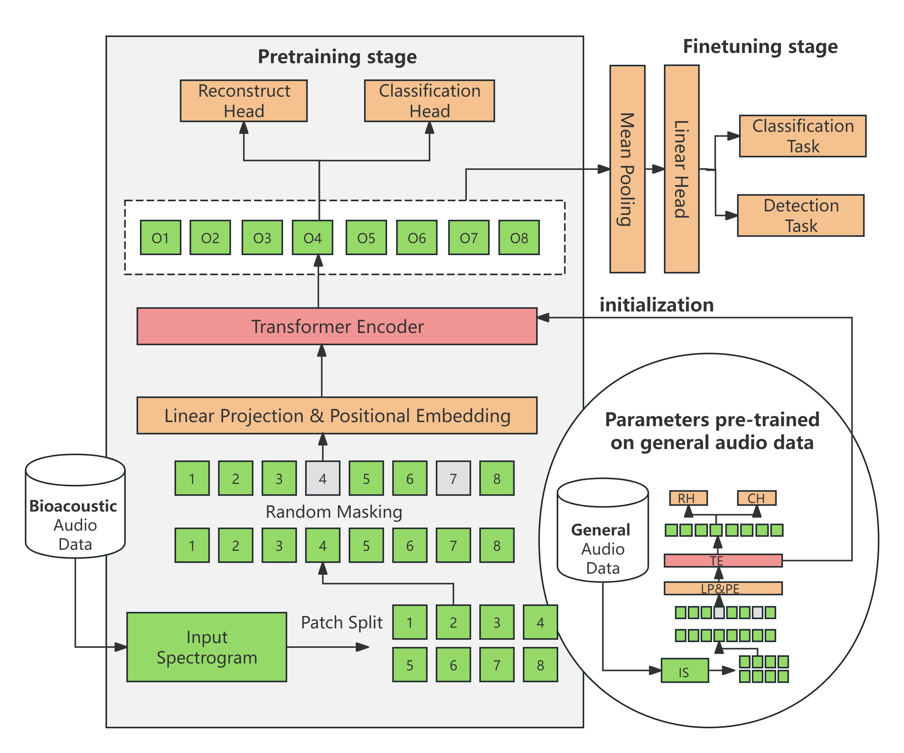
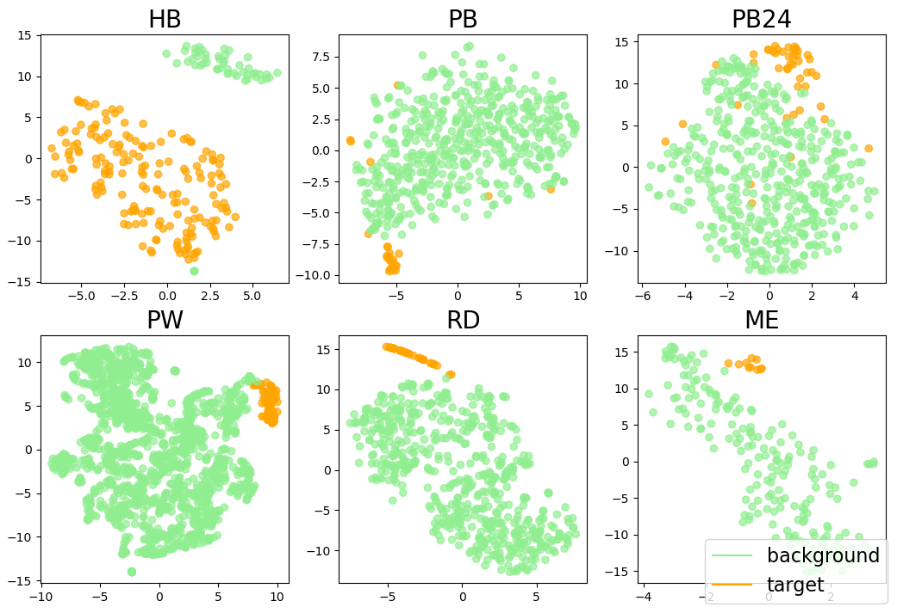

# Scaling Bioacoustic Signal Pre-training with Million Samples Via Mask-Modeling

<div style="display: flex; justify-content: space-around;">  
      
      
</div>


We introduce GPM-BT (General Pre-training Model for Bioacoustic Tasks), a self-supervised, Transformer-based model pre-trained on approximately 1.2 million unannotated bioacoustic audio samples. GPM-BT achieves state-of-the-art performance on the [BEANS benchmark](https://github.com/earthspecies/beans) demonstrating a strong ability to represent and understand bioacoustic audio signals amidst complex background noises. See [our paper]() for more details.

GPM-BT builds upon the research of [BEANS](https://github.com/earthspecies/beans) and [SSAST](https://github.com/YuanGongND/ssast). We presume you have prior knowledge of these two projects.


## Installation

1. Using [environments.yaml](https://github.com/colaudiolab/GPM-BT/blob/master/environment.yaml) file to create a conda environment 
	
	```
	conda env create -f environment.yaml
	```

2. Refer to [BEANS](https://github.com/earthspecies/beans) to install the benchmark itself

	```
	pip install -e .
	```

3. Refer to [BEANS](https://github.com/earthspecies/beans) for data preparation


4. Download the pre-trained model
<table style="border-collapse: collapse; width: 65%;">  
<thead>  
  <tr>  
    <td style="border: 1px solid black; padding: 0;">pre-trained model</th>  
    <td style="border: 1px solid black; padding: 0;">classification</th>  
    <td style="border: 1px solid black; padding: 0;">detection</th>  
    <td style="border: 1px solid black; padding: 0;">auxiliary</th>  
	<td style="border: 1px solid black; padding: 0;">all</th>
  </tr>  
</thead>  
<tbody>  
  <tr>  
    <td style="border: 1px solid black; padding: 0;">
	<a href="https://pan.baidu.com/s/1KTngJnnyqF_ltCWm1BJ4IQ?pwd=bctu">secondary-1.23M-bio-patch</a>
	</th>  
    <td style="border: 1px solid black; padding: 0;">0.797</td>  
    <td style="border: 1px solid black; padding: 0;">0.440</td>  
    <td style="border: 1px solid black; padding: 0;">0.879</td>
	<td style="border: 1px solid black; padding: 0;">0.662</td>   
  </tr>  
  <tr>  
    <td style="border: 1px solid black; padding: 0;">
	<a href="https://pan.baidu.com/s/1X5Maiv9eD2UrNiSRAtgvuw?pwd=x8ag">from scrach-1.23M-bio-patch</a>
	</th>  
    <td style="border: 1px solid black; padding: 0;">0.793</td>  
    <td style="border: 1px solid black; padding: 0;">0.440</td>  
    <td style="border: 1px solid black; padding: 0;">0.869</td>
	<td style="border: 1px solid black; padding: 0;">0.658</td>  
  </tr> 
  <tr>  
    <td style="border: 1px solid black; padding: 0;">
	<a href="https://pan.baidu.com/s/1UXS3utNETpXavpgHBN4g4Q?pwd=x6qu">from scrach-0.80M-bio-patch</a>
	</th>  
    <td style="border: 1px solid black; padding: 0;">0.774</td>  
    <td style="border: 1px solid black; padding: 0;">0.416</td>  
    <td style="border: 1px solid black; padding: 0;">0.850</td>
	<td style="border: 1px solid black; padding: 0;">0.637</td>  
  </tr>
  <tr>  
    <td style="border: 1px solid black; padding: 0;">
	<a href="https://pan.baidu.com/s/19XbT19RhA6-Fu_WdsiUNnQ?pwd=xieb">from scrach-0.46M-bio-patch</a>
	</th>  
    <td style="border: 1px solid black; padding: 0;">0.749</td>  
    <td style="border: 1px solid black; padding: 0;">0.358</td>  
    <td style="border: 1px solid black; padding: 0;">0.851</td>
	<td style="border: 1px solid black; padding: 0;">0.603</td>  
  </tr> 
  <tr>  
    <td style="border: 1px solid black; padding: 0;">
	<a href="https://pan.baidu.com/s/1d9gAwfBrgLkF6DlRIyEGsA?pwd=7rce">from scrach-0.12M-bio-patch</a>
	</th>  
    <td style="border: 1px solid black; padding: 0;">0.738</td>  
    <td style="border: 1px solid black; padding: 0;">0.351</td>  
    <td style="border: 1px solid black; padding: 0;">0.812</td>
	<td style="border: 1px solid black; padding: 0;">0.589</td>  
  </tr> 
  <tr>  
    <td style="border: 1px solid black; padding: 0;">
	<a href="https://pan.baidu.com/s/12ksF3CKejhY-g32MtvU3hg?pwd=iebd">from scrach-1.23M-bio-frame</a>
	</th>  
    <td style="border: 1px solid black; padding: 0;">0.781</td>  
    <td style="border: 1px solid black; padding: 0;">0.349</td>  
    <td style="border: 1px solid black; padding: 0;">0.822</td>
	<td style="border: 1px solid black; padding: 0;">0.608</td>  
  </tr> 
  <tr>  
    <td style="border: 1px solid black; padding: 0;">
	<a href="https://pan.baidu.com/s/1CMd74Ws0ZTYkTcjCjyjS4g?pwd=r5kw">from scrach-2.23M-gen-frame</a>
	</th>  
    <td style="border: 1px solid black; padding: 0;">0.766</td>  
    <td style="border: 1px solid black; padding: 0;">0.318</td>  
    <td style="border: 1px solid black; padding: 0;">0.805</td>
	<td style="border: 1px solid black; padding: 0;">0.586</td>  
  </tr> 
  <tr>  
    <td style="border: 1px solid black; padding: 0;">
	<a href="https://pan.baidu.com/s/1Mbv8GhfUWLSp6ZX4LXho_g?pwd=mk95">from scrach-2.23M-gen-patch</a>
	</th>  
    <td style="border: 1px solid black; padding: 0;">0.785</td>  
    <td style="border: 1px solid black; padding: 0;">0.433</td>  
    <td style="border: 1px solid black; padding: 0;">0.873</td>
	<td style="border: 1px solid black; padding: 0;">0.653</td>  
  </tr> 
<t/body>  
</table>

## Running the GPM-BT
You can run the GPM-BT model by running:

```
python run_benchmark.py
```

Before running, you need to replace the `--data-directory-path` parameter with the path to your `data` folder, replace the `--load-pretrained-mdl-path` parameter with the location of pre-trained model, and choose the correct masking method for the `--Patch-or-Frame` parameter.

This will write result files into the `logs` directory.
